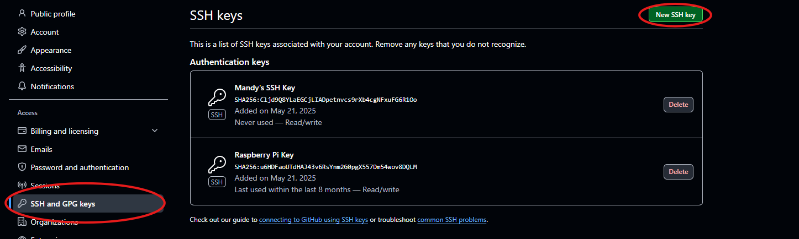
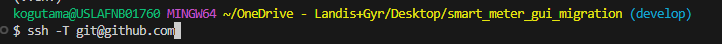
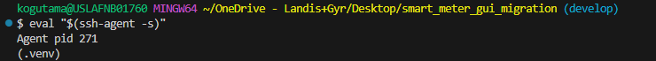
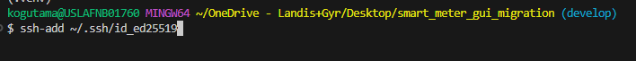
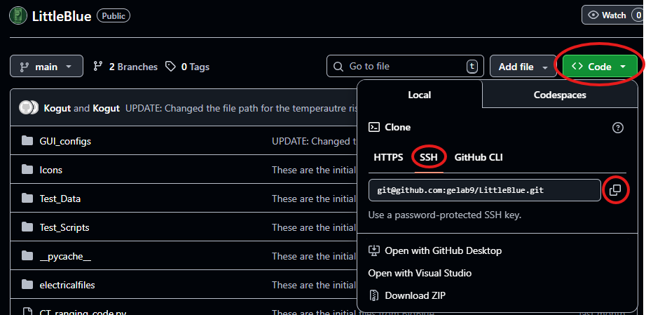

# 🌡️ LittleBlue - Getting Started 🌡️

**Disclaimer:** Please review the `requirements.txt` for all libraries and imports necessary for running this application.

## Table of Contents
- [Initial Setup](#initial-setup)
- [Branch Management](#branch-management)
- [Testing and Development](#testing-and-development)

---

## Initial Setup

Follow these steps to get up and running quickly:

### 1. Clone the Project using SSH

For security and easy authentication, we recommend using SSH to clone the repository.

```bash
git clone git@github.com:gelab9/LittleBlue.git
```


> **Note:** Depending on admin rights and IT blockage, you will highly likely need to generate this key using PowerShell as administrator.

### 2. Generate SSH Key Pair

```bash
ssh-keygen -t ed25519 -C "your_email@example.com"
```


### 3. Add SSH Key to GitHub

1. Once the key has generated, log into GitHub using your browser
2. Go to **Settings** → **SSH and GPG keys**
3. Click **New SSH key**
4. Paste your generated public key contents



### 4. Confirm SSH Connection

```bash
ssh -T git@github.com
```



You should see a message confirming you're authenticated.

### 5. Start the SSH Agent

```bash
eval "$(ssh-agent -s)"
```



### 6. Add Your Key to the SSH Agent

```bash
ssh-add ~/.ssh/id_ed25519
```



### 7. Clone the Repository

1. Go to your repository on GitHub
2. Click **Code**
3. Copy the SSH link



```bash
git clone git@github.com:username/repository.git
```

---

## Branch Management

Within our repository, there are two main branches:

- **main** - Contains the BigBlue code that was recreated for new sources
- **develop** - Contains the code for the reformatted Temperature Rise application

### Fetching develop from Remote

If you just cloned the repository, you won't have `develop` locally. Here's how to get it from GitHub:

```bash
# Make sure your branch is clean
git branch
git status

# Fetch and checkout
git fetch origin
git checkout -b develop origin/develop
```

### Checking Out the develop Branch

```bash
# Check what branch you're in
git branch
git status

# Switch to the develop branch
git switch develop

# Or alternatively
git checkout develop
```

### Switching Back to main

```bash
# Make sure your branch is clean
git branch
git status

# If you don't have main locally yet
git fetch origin

# Switch to the main branch
git switch main
```

### Force Push and Pull (Use with Caution)

> **Warning:** Force pushing will overwrite remote changes with your current local files.

#### Force Push

```bash
# Force push to main
git push --force origin main

# Or force push to another branch
git push --force origin <branch-name>
```

#### Reset Changes

```bash
git reset --hard <commit-hash>
git push --force origin <branch-name>
```

#### Pull Forced Changes

```bash
# Make sure you're in the repo
git status
# You should see 'On branch develop'

# Confirm the remote
git remote -v
# You should see:
# origin  git@github.com:your-org/your-project.git (fetch)
# origin  git@github.com:your-org/your-project.git (push)

# Fetch everything fresh from the remote
git fetch origin

# Checkout the develop branch
git checkout develop

# Or if you don't have it locally
git checkout -b develop origin/develop

# Reset your local branch to match the remote branch
git reset --hard origin/develop

# Verify
git status
# You should see:
# On branch develop
# Your branch is up to date with 'origin/develop'.
# nothing to commit, working tree clean
```

---

## Testing and Development

### Connecting the .NET Application and Checking Connections

#### Step 1: Connect to COM Port

```bash
curl.exe -i -X POST "http://127.0.0.1:5055/daq/connect" \
  -H "Content-Type: application/json" \
  --data-binary "@connect.json"
```

#### Step 2: Call DAQ IDN to Verify Communication

```bash
curl.exe -i "http://127.0.0.1:5055/daq/idn"
```

These commands check the DAQ 34970A instrument and verify a serial connection, returning:
- Manufacturer
- Serial number
- Firmware version (FW)

**Expected Response:**
```json
{"idn":"HEWLETT-PACKARD,34970A,0,13-2-2"}
```

### Identifying the 34970A (Agilent)

```bash
# Connect to the device
curl.exe -i -X POST "http://127.0.0.1:5055/daq/connect" \
  -H "Content-Type: application/json" \
  --data-binary "@connect.json"

# Get identification
curl.exe -i "http://127.0.0.1:5055/daq/idn"
```

---

## Troubleshooting

### .NET Installation Issues on Debian 13 (Trixie)

If you're running **Debian 13 (Trixie)** instead of Debian 12 (Bookworm), you may encounter issues installing `dotnet-sdk-8.0.417` via apt. This is because Microsoft has not officially published a Debian 13 apt repository yet.

#### ✅ Clean Fix for Debian 13

Use Microsoft's official install script instead of apt. This is the recommended method for Debian 13.

**Step 1: Download the Installer**

```bash
wget https://dot.net/v1/dotnet-install.sh
chmod +x dotnet-install.sh
```

**Step 2: Install .NET 8 SDK**

```bash
./dotnet-install.sh --channel 8.0
```

This installs the latest .NET 8 SDK (including the correct patch version).

**Step 3: Add .NET to PATH**

Add .NET to your current shell session:

```bash
export PATH=$PATH:$HOME/.dotnet
```

To make it permanent:

```bash
echo 'export PATH=$PATH:$HOME/.dotnet' >> ~/.bashrc
source ~/.bashrc
```

**Step 4: Verify Installation**

```bash
dotnet --version
```

You should see output like:

```
8.0.xxx
```

#### Checking Your Debian Version

Not sure which Debian version you're running? Check with:

```bash
cat /etc/debian_version
# or
lsb_release -a
```

---

## Additional Resources

For installation instructions on Linux Debian environments, see [README_INSTALL.md](README_INSTALL.md)